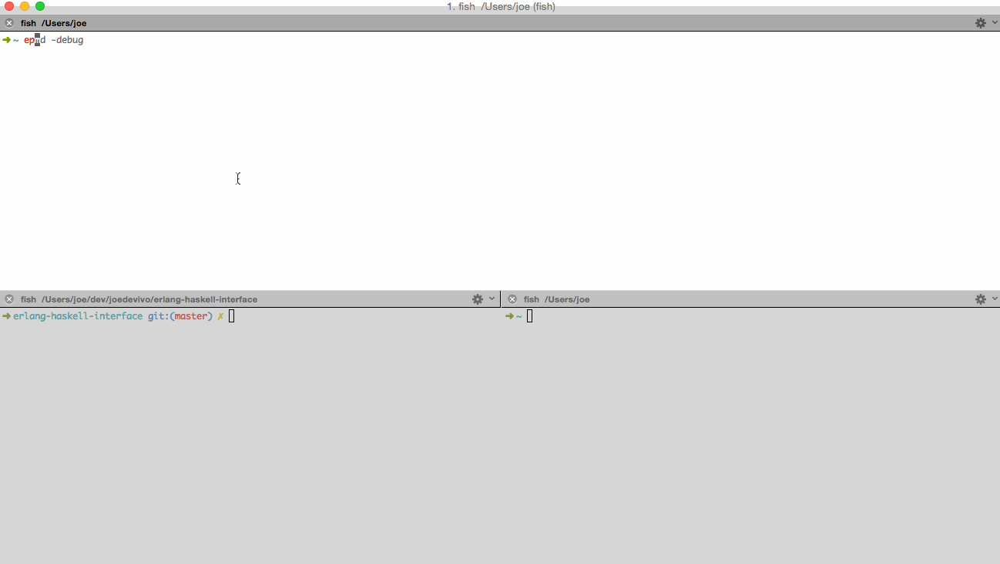

erlang-haskell-interface
========================

Originally copied from the 0.1 tarball found
[here](http://hackage.haskell.org/package/erlang-0.1). Credit to Eric
Sessoms (@esessoms) for the original work, which can be found
unaltered in the second commmit of this repository
(bf8b4aee1c15ac98e8c63f63d36ab4c9ff1e3d26)

## EPMD

The EMPD (Erlang Port Mapper Daemon) is the guy behind the guy behind
the guy. Seriously tho, he's how Erlang nodes know about other Erlang
nodes. We can talk to EPMD from Haskell as long as we speak with the
Erlang Distribution Protocol, which is fortunately documented
[here](http://www.erlang.org/doc/apps/erts/erl_dist_protocol.html)

In this project, the module that really talks to EPMD is
[Network](src/Foreign/Erlang/Network.lhs)

## Current Status

`runghc Test` will start a haskell erlang node that registers itself
with EPMD and will respond to "SEND_NAME" as defined by the Erlang
Distribution Protocol

